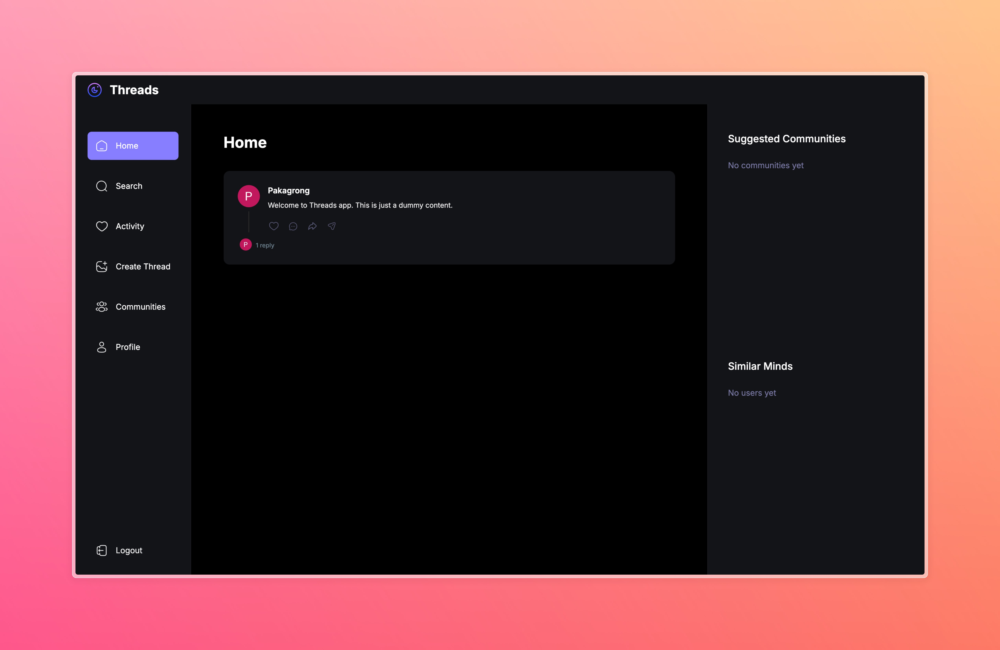
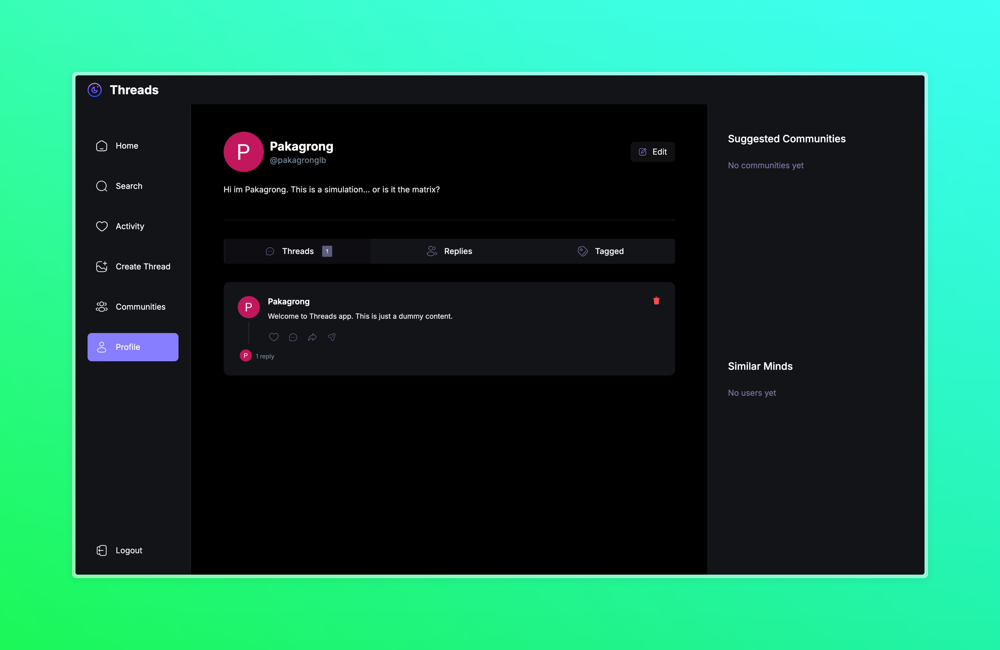

# 📱 Threads - A Social Media Platform Clone

## 🌟 Project Overview





Threads is a full-stack social media application built with modern web technologies, inspired by popular social platforms. It allows users to create threads, interact with communities, and share their thoughts.

## 🚀 Technologies Used

### Frontend
- Next.js 13
- React
- TypeScript
- Tailwind CSS
- Shadcn UI Components
- React Hook Form

### Backend
- MongoDB (Mongoose)
- Next.js API Routes
- Server Actions

### Authentication & User Management
- Clerk Authentication
- User Onboarding
- Organization Management

### File Uploads
- UploadThing

### Additional Libraries
- Zod (Validation)
- Svix (Webhook Management)

## ✨ Features

- 🔐 Secure Authentication
- 👥 User Profiles
- 🌐 Community Creation and Management
- 💬 Thread Creation and Commenting
- 📸 Image Uploads
- 🔍 Search Functionality
- 📱 Responsive Design

## 🛠 Prerequisites

- Node.js (v18+)
- npm or Yarn
- MongoDB Atlas Account
- Clerk Account
- UploadThing Account

## 🚦 Getting Started

### 1. Clone the Repository
```bash
git clone https://github.com/yourusername/threads-app.git
cd threads-app
```

### 2. Install Dependencies
```bash
npm install
# or
yarn install
```

### 3. Set Up Environment Variables
Create a `.env` file in the root directory with the following variables:
```
MONGODB_URL='your_mongodb_connection_string'
CLERK_SECRET_KEY='your_clerk_secret_key'
NEXT_PUBLIC_CLERK_PUBLISHABLE_KEY='your_clerk_publishable_key'
NEXT_CLERK_WEBHOOK_SECRET='your_clerk_webhook_secret'
UPLOADTHING_SECRET='your_uploadthing_secret'
UPLOADTHING_APP_ID='your_uploadthing_app_id'
```

### 4. Run the Development Server
```bash
npm run dev
# or
yarn dev
```

Open [http://localhost:3000](http://localhost:3000) in your browser.

## 📂 Project Structure
```
threads-app/
├── app/                # Next.js app directory
│   ├── (auth)/         # Authentication pages
│   ├── (root)/         # Main application pages
│   └── api/            # API routes and webhooks
├── components/         # Reusable React components
├── lib/                # Utility functions and server actions
│   ├── actions/        # Server-side actions
│   ├── models/         # Mongoose models
│   └── utils.ts        # Utility functions
├── public/             # Static assets
└── styles/             # Global styles
```

## 🔧 Configuration

### Clerk Authentication
1. Create a Clerk account
2. Set up your application in the Clerk dashboard
3. Configure sign-in and sign-up routes
4. Add webhook endpoint

### MongoDB
1. Create a MongoDB Atlas cluster
2. Whitelist your IP address
3. Create a database user
4. Copy the connection string

### UploadThing
1. Create an UploadThing account
2. Generate API keys
3. Configure file upload settings

## 🧪 Testing
```bash
# Run linter
npm run lint

# Future: Add testing commands
```

## 🚢 Deployment

### Vercel (Recommended)
1. Connect your GitHub repository
2. Set environment variables in Vercel dashboard
3. Deploy with one click

### Other Platforms
- Ensure Node.js support
- Set environment variables
- Use `npm run build` and `npm start`

## 🤝 Contributing
1. Fork the repository
2. Create a feature branch
3. Commit your changes
4. Push to the branch
5. Create a Pull Request

## 📄 License
This project is open-source and available under the MIT License.

## 🙏 Acknowledgements
- Next.js
- Clerk
- MongoDB
- UploadThing
- Tailwind CSS
- Shadcn UI

## 📞 Support
For issues or questions, please open a GitHub issue.